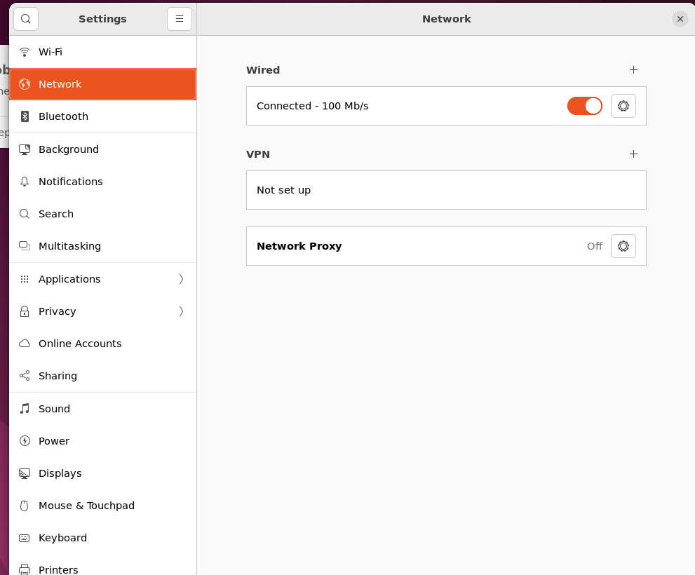

# BXI 自主探索导航示例

本项目提供一套基于 BXI 硬件、Livox MID-360s 雷达和 ROS 2 Humble 的自主探索导航示例。启动后会同时运行里程计、导航和雷达驱动节点，并通过 RViz 进行可视化与目标点交互。

## 运行环境

- Ubuntu 22.04
- ROS 2 Humble
- Livox MID-360s 雷达
- 已配置好的 BXI 机器人控制器

安装依赖：

```bash
sudo apt update
sudo apt install ros-humble-pcl-ros libgoogle-glog-dev
```

## 快速开始

### 1. 编译并安装 Livox SDK2

```bash
cd src/Livox_SDK2
mkdir -p build
cd build
cmake ..
make -j8
sudo make install
```

### 2. 编译 ROS 2 工作空间

在仓库根目录执行：

```bash
cd src/livox_ros_driver2
bash build.sh humble
```

该脚本会回到工作空间根目录执行 `colcon build`，并生成 `install/` 目录。

### 3. 启动系统

回到仓库根目录：

```bash
bash start.sh
```

脚本会创建一个 `tmux` 会话，并启动三个窗口：

| 窗口 | 功能 | 启动内容 |
| --- | --- | --- |
| 里程计 | 点云里程计 | `point_lio point_lio.launch.py` |
| 导航 | 自主探索与 RViz | `vehicle_simulator system_real_robot.launch.py` |
| 雷达驱动 | Livox 雷达数据 | `livox_ros_driver2 msg_MID360s_launch.py` |

等待第二个 RViz 界面正常打开后，系统即启动完成。


雷达驱动正常后，应能看到以下话题持续发布：

- `/livox/imu`
- `/livox/lidar`


### 4. 发布目标点

有两种方式可以给机器人发送目标位置：

- 在 RViz 中使用 `Waypoint` 工具，直接点击期望机器人前往的位置。
- 向 `/way_point` 话题发布目标点消息。

导航模块会向 `/cmd_vel` 发布速度指令。实际机器人使用时，需要将 `/cmd_vel` 转换为底盘控制器可接收的控制命令。

### 5. 关闭系统

```bash
bash stop.sh
```

## 雷达配置

雷达无法启动时，通常是网络或雷达配置不正确。建议先确认电脑和雷达处于同一网段，再检查配置文件。

### 1. 配置静态 IP

将电脑网口配置为静态 IP，例如 `192.168.1.51`。建议使用网线直连雷达进行配置，远程桌面环境下可能会遇到权限问题。




### 2. 修改雷达配置文件

配置文件路径：

```text
src/livox_ros_driver2/config/MID360s_config.json
```

重点检查两个字段：

- `host_ip`：电脑网口的静态 IP，例如 `192.168.1.51`。
- `ip`：雷达 IP。MID-360s 通常为 `192.168.1.1xx`，末尾两位可参考雷达机身二维码下方的数字。

示例：

```json
{
  "lidar_summary_info": {
    "lidar_type": 8
  },
  "Mid360s": {
    "lidar_net_info": {
      "cmd_data_port": 56100,
      "push_msg_port": 56200,
      "point_data_port": 56300,
      "imu_data_port": 56400,
      "log_data_port": 56500
    },
    "host_net_info": [
      {
        "host_ip": "192.168.1.51",
        "cmd_data_port": 56101,
        "push_msg_port": 56201,
        "point_data_port": 56301,
        "imu_data_port": 56401,
        "log_data_port": 56501
      }
    ]
  },
  "lidar_configs": [
    {
      "ip": "192.168.1.128",
      "pcl_data_type": 1,
      "pattern_mode": 0,
      "extrinsic_parameter": {
        "roll": 0.0,
        "pitch": 0.0,
        "yaw": 0.0,
        "x": 0,
        "y": 0,
        "z": 0
      }
    }
  ]
}
```

修改完成后重新编译并启动：

```bash
cd src/livox_ros_driver2
bash build.sh humble
cd ../..
bash start.sh
```

如果不确定雷达 IP，可以先配置电脑静态 IP 后启动程序，雷达驱动终端通常会打印扫描到的雷达 IP。

## 常见问题
### 雷达没有数据

按以下顺序排查：

1. 电脑静态 IP 是否与 `host_ip` 一致。
2. 雷达 IP 是否与配置文件中的 `ip` 一致。
3. 电脑和雷达是否在同一网段。
4. `/livox/imu` 和 `/livox/lidar` 是否正在发布。
5. 修改配置后是否重新编译并重启。

### 远程桌面或 root 权限下 RViz 无法显示

如果通过远程桌面操作，并且启动机器人需要进入 root 权限，可能会遇到图形界面无法显示的问题。可以先在普通用户终端执行：

```bash
xhost local:root
```

再进入 root 环境启动：

```bash
sudo su
bash start.sh
```
