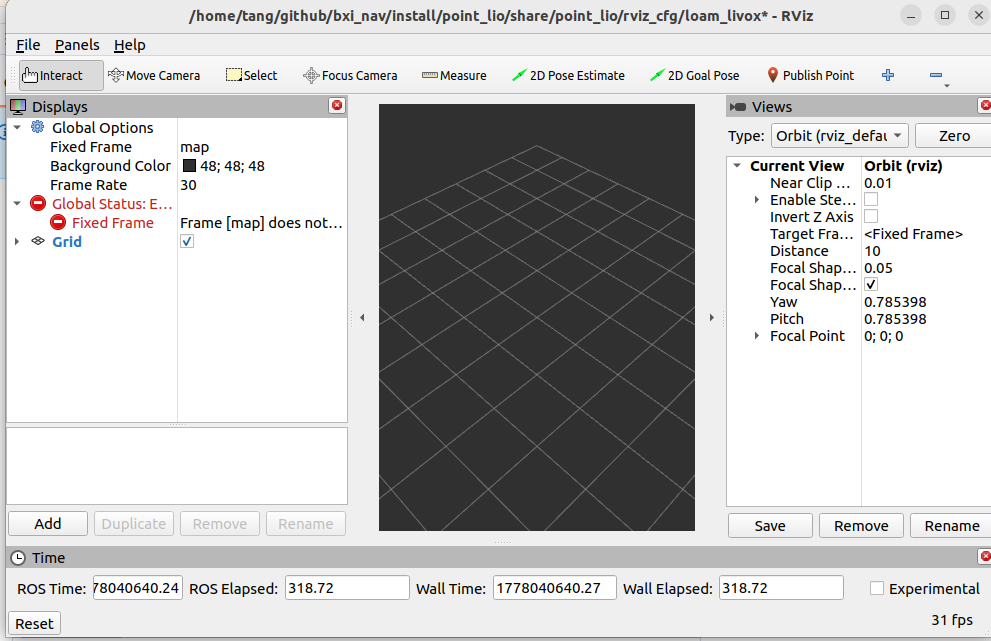
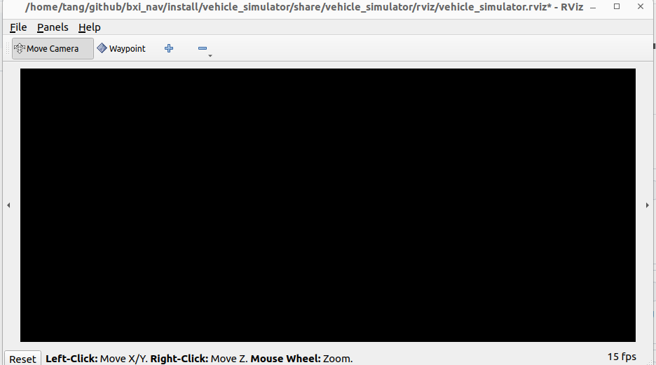
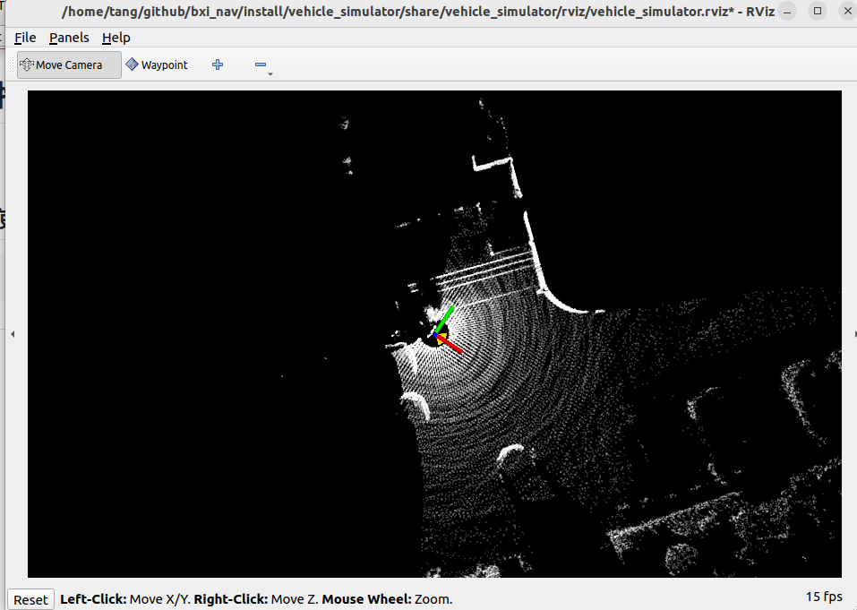

# 一个基于BXI硬件的自主探索导航示例
## 使用方法
### 1. 编译livox_sdk
```
cd src/Livox-SDK2/
mkdir build
cd build/
cmake ..
make -j8
sudo make install
```
### 2. 编译
```
cd src/livox_ros_driver2/
bash build.sh humble
# 需要编译sdk 并install 它
```
### 3. 启动
```
bash start.sh
```
等待第二个rviz启动则启动成功<br>


随后多的一个终端里面启动雷达驱动节点即可 确保发布这两个节点/**livox/imu** **/livox/lidar**<br>

可以往 **/way_point** 话题里发期望机器人移动的位置<br>
**/cmd_vel**是导航发布的移动指令，需要自行转化成机器人的控制器<br>
### 4. 关闭
```
bash stop.sh
```
## 常见问题
### 1.坐标系问题
本项目的雷达硬件是倒置的，所以本项目做里坐标系变化，如果后续雷达是正向放置，需要自行更改
### 2.雷达驱动问题
本项目是使用MID360,如果后续使用的是MID360s，需要使用官方提供的SDK包