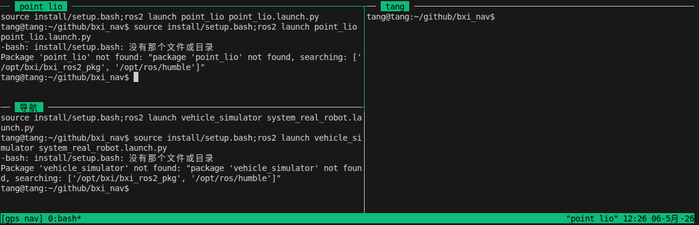

# 一个基于BXI硬件的自主探索导航示例
## 前置安装
```
# ros2 humble
sudo apt install ros-humble-pcl-ros
sudo apt install libgoogle-glog-dev
```
## 快速使用
### 1. 编译livox_sdk
```
cd src/Livox-SDK2/
mkdir build
cd build/
cmake ..
make -j8
sudo make install
```
### 2. 编译
```
cd src/livox_ros_driver2/
bash build.sh humble
```
### 3. 启动
```
bash start.sh
```
等待第二个rviz启动则启动成功<br>


随后多的一个终端里面启动雷达驱动节点即可 确保发布这两个节点/**livox/imu** **/livox/lidar**<br>


可以往 **/way_point** 话题里发期望机器人移动的位置，或者用RVIZ里面的Waypoint在可视化界面里点想要去的位置<br>
**/cmd_vel**是导航发布的移动指令，需要自行转化成机器人的控制器<br>
### 4. 关闭
```
bash stop.sh
```
## 常见问题
### 1.坐标系问题
本项目的雷达硬件是倒置的,如果后续雷达是正向放置，需要自行更改坐标系<br>
### 2.雷达无法启动
应该是没有配置好雷达驱动<br>
#### 配置静态ip

点击设置的齿轮，如图配置即可，建议直连配置，远程桌面配置可能有权限的问题<br>


#### 配置修改
bxi_nav/src/livox_ros_driver2/config/MID360s_config.json
```
{
  "lidar_summary_info" : {
    "lidar_type": 8
  },
  "Mid360s": {
    "lidar_net_info" : {
      "cmd_data_port"  : 56100,
      "push_msg_port"  : 56200,
      "point_data_port": 56300,
      "imu_data_port"  : 56400,
      "log_data_port"  : 56500
    },
    "host_net_info" : [
      {
        "host_ip"        : "192.168.1.51", # 这里要改成你设置好的静态ip
        "cmd_data_port"  : 56101,
        "push_msg_port"  : 56201,
        "point_data_port": 56301,
        "imu_data_port"  : 56401,
        "log_data_port"  : 56501
      }
    ]
  },
  "lidar_configs" : [
    {
      "ip" : "192.168.1.128", #这个是雷达的ip 具体在雷达上二维码下的数字末两位 192.168.1.1xx
      "pcl_data_type" : 1,
      "pattern_mode" : 0,
      "extrinsic_parameter" : {
        "roll": 0.0,
        "pitch": 0.0,
        "yaw": 0.0,
        "x": 0,
        "y": 0,
        "z": 0
      }
    }
  ]
}
#修改后重新编译即可
```
**如果不好查看雷达ip，可以先配置好静态ip然后运行该程序，在终端可以看到具体ip**
### 3.可视化相关问题
如果是远程桌面，而且控制机器人需要进入root权限，这个时候出现无法显示界面问题
```
xhost local:root #在用户界面输入这个
sudo su #再进入root桌面
bash start.sh #启动程序即可 可视化界面就出来了
```

